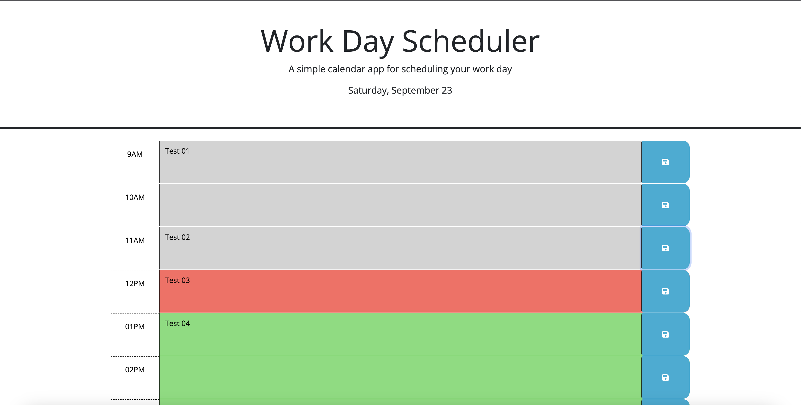
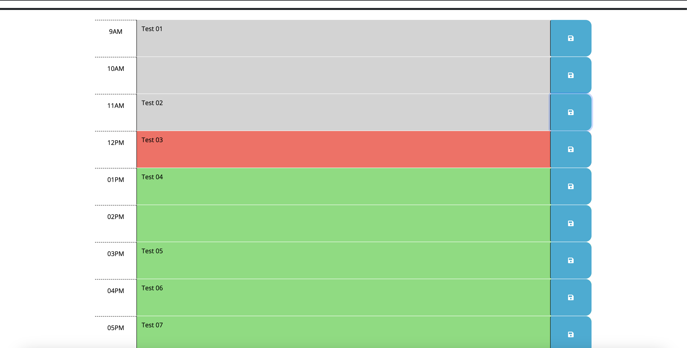
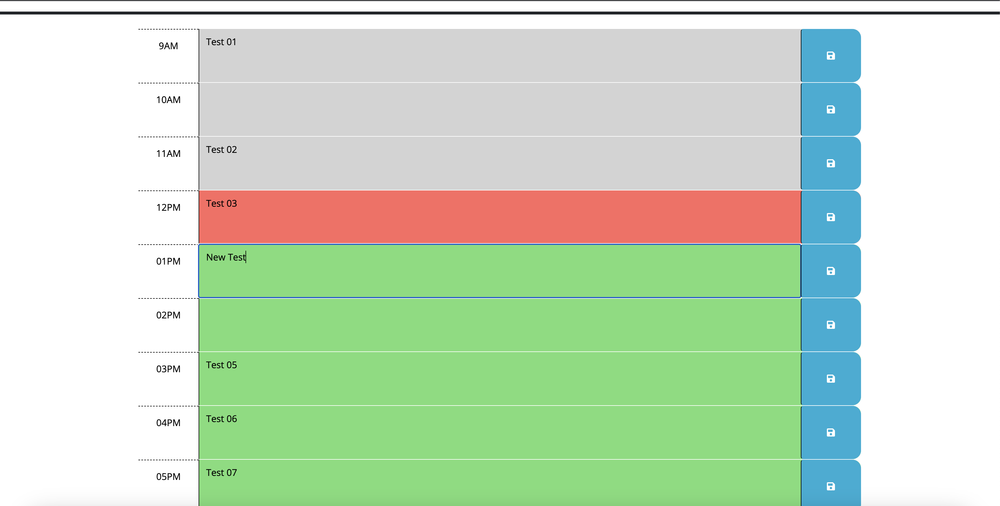

# Work-Day-Scheduler

# Create a simple calendar application that allows a user to save events for each hour.

## Description

Create a simple calendar application that allows a user to save events for each hour of a typical working day (9am&ndash;5pm). This app will run in the browser and feature dynamically updated HTML and CSS powered by jQuery.

## Installation

### HTML

Build HTML file , header for my header and current date , and a div for each hour on the schedule can be added more .

### JavaScript

1- creat a function gets current date and show it on the header.
2- then get current hour.
3- Loop through each time block to set the class.
4- Load saved events from local storage.
5- Save events to local storage

## Usage

Included screenshots shows the usage and the deployed URL.

[Work-Day-Scheduler](https://mahmoudahmed0528.github.io/Work-Day-Scheduler/)
